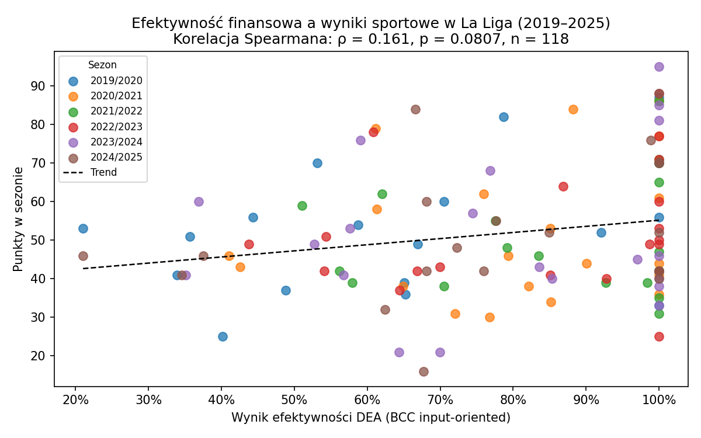
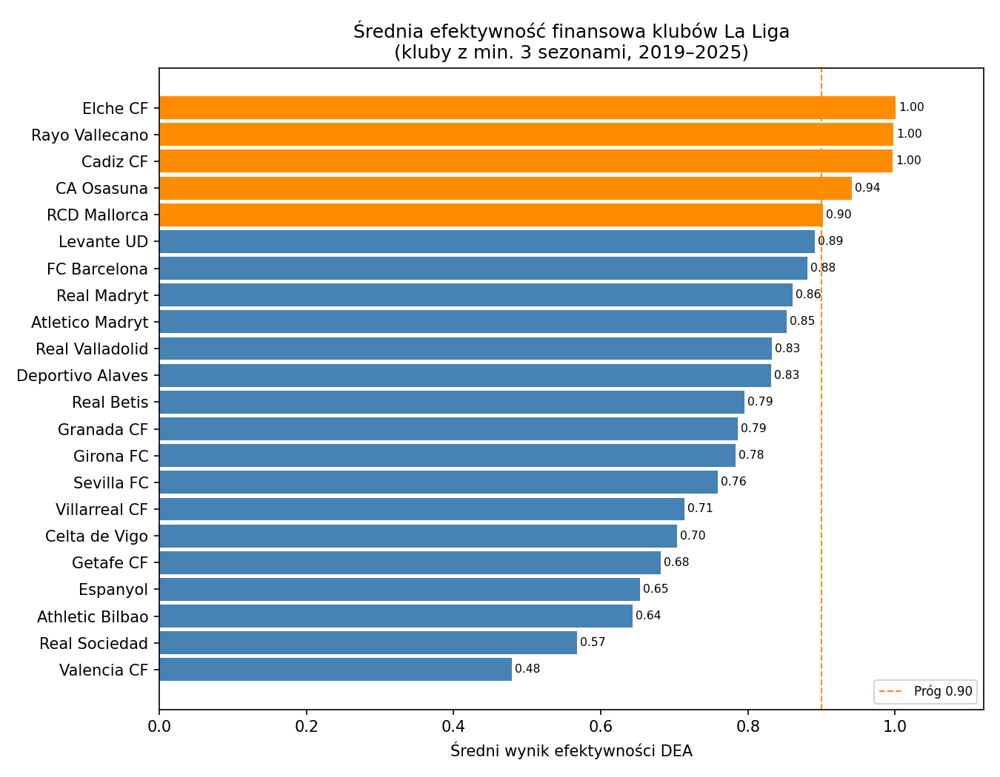
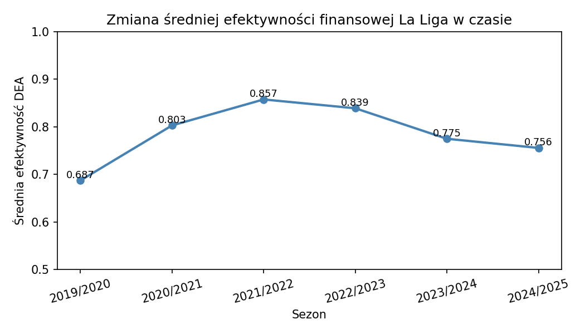

# La Liga Financial Efficiency Analysis

Analysis of financial efficiency of La Liga clubs across six seasons (2019–2025), based on Data Envelopment Analysis (DEA) results from my bachelor's thesis at SGGW Warsaw.

## Background

Spanish football's financial regulations (LCPD) impose spending limits on La Liga clubs based on their revenue. This project examines whether clubs operating under these constraints convert their financial resources into sporting results efficiently, and how that efficiency has evolved over time.

## Data

- **Source:** Compiled manually from La Liga official reports, UEFA club licensing data, and Transfermarkt for squad valuations
- **Coverage:** 118 observations across 6 seasons, 27 unique clubs
- **Variables:**
  - `LCPD` — club's spending limit (EUR millions)
  - `Wartosc_kadry` — squad market value (EUR millions)
  - `Punkty` — points earned in the season
  - `Pozycja` — final league position
  - `Efektywnosc` — DEA efficiency score (BCC input-oriented model, range 0–1)
  - `Jednostki_ref` — reference clubs used in DEA benchmarking

## Methodology

Efficiency scores were calculated using the **BCC input-oriented DEA model** (Banker, Charnes, Cooper 1984), which assumes variable returns to scale. Inputs: LCPD limit and squad value. Output: league points.

A score of 1.0 indicates a fully efficient club — it achieved the maximum possible points given its financial inputs relative to other clubs in the sample. Scores below 1.0 indicate how much output a club could theoretically improve without additional resources.

Statistical analysis uses **Spearman rank correlation** to assess the relationship between efficiency scores and league position (rho = −0.309, p = 0.00065, n = 118), confirming a statistically significant but moderate negative correlation — more efficient clubs tend to finish higher, though financial efficiency alone does not determine league outcomes. Note: scores of 1.0 are assigned to multiple clubs per season by construction of the BCC model and do not reflect a strict ranking among efficient units.

## Results

| Season | Mean Efficiency | % Fully Efficient (score = 1.0) |
|---|---|---|
| 2019/2020 | 0.687 | 30% |
| 2020/2021 | 0.803 | 30% |
| 2021/2022 | 0.857 | 47% |
| 2022/2023 | 0.839 | 45% |
| 2023/2024 | 0.775 | 35% |
| 2024/2025 | 0.756 | 32% |

Average efficiency peaked in 2021/2022, coinciding with post-COVID budget constraints that forced clubs to operate leaner squads relative to their spending limits.

## Visualisations

**Efficiency vs points by season**


**Average efficiency by club (min. 3 seasons)**


**Mean efficiency trend over time**


## How to Run

```bash
pip install pandas matplotlib scipy
python laliga_analysis.py
```

Outputs three PNG charts and prints summary statistics to the console.

## Tools

Python 3 — pandas, matplotlib, scipy
