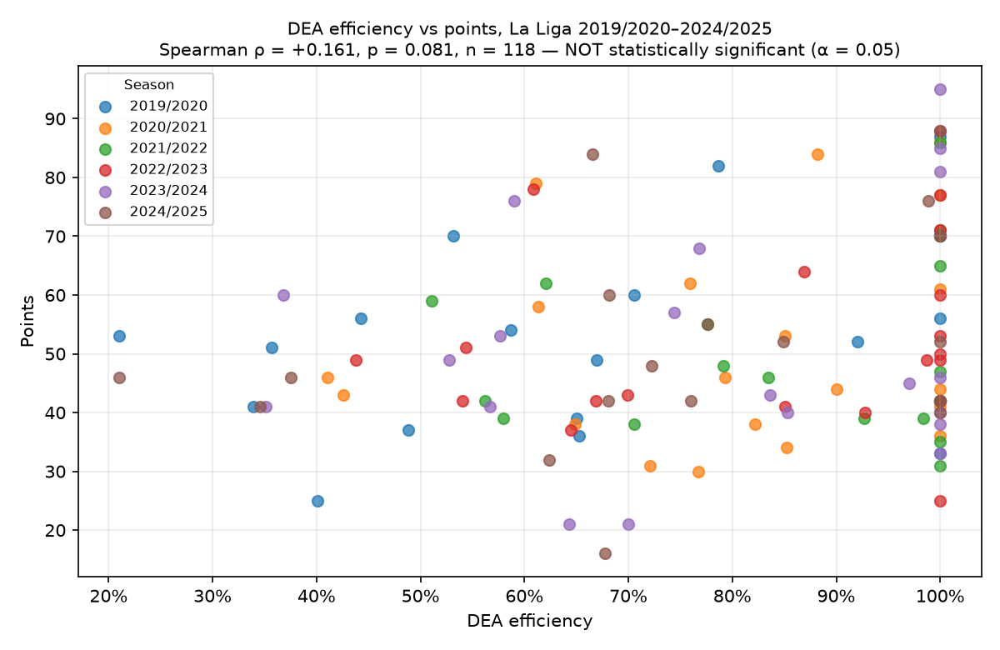
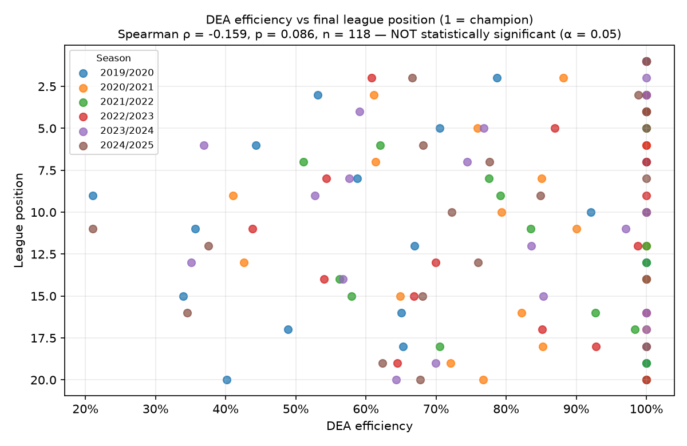
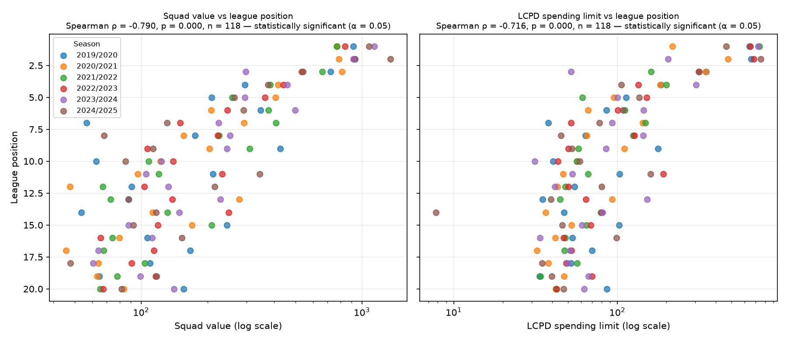
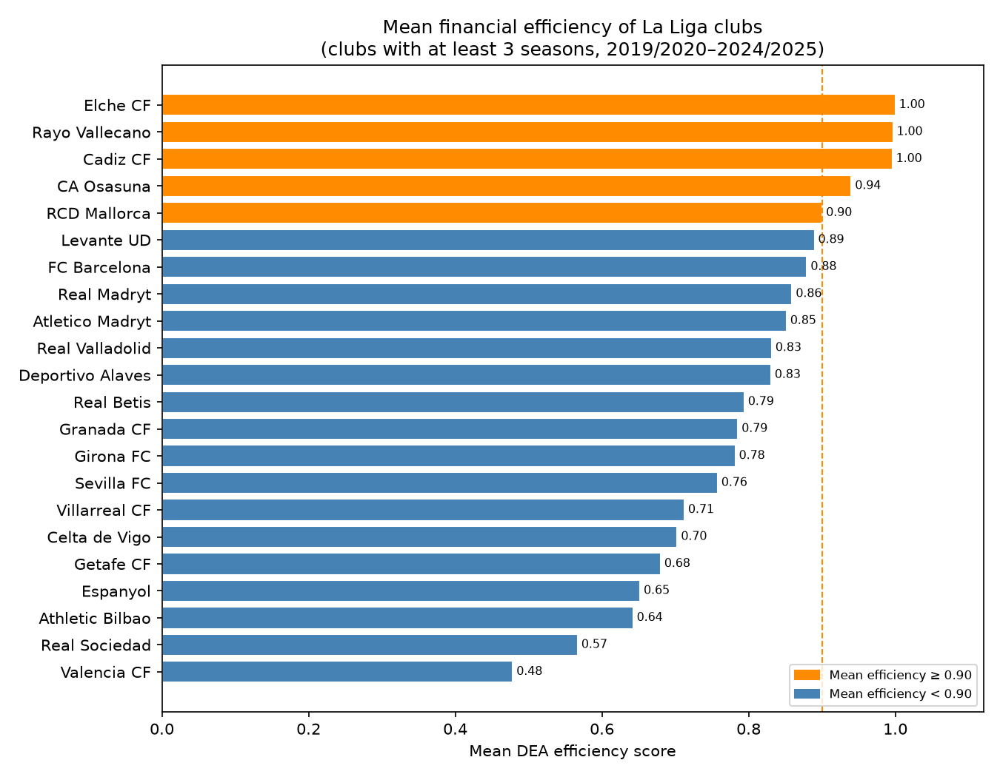
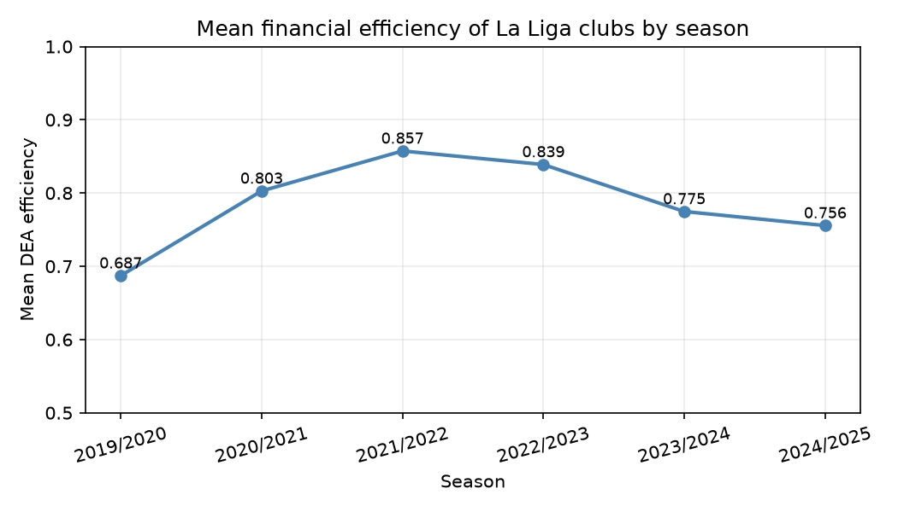

# La Liga Financial Efficiency Analysis

Analysis of financial efficiency of La Liga clubs across six seasons (2019/2020–2024/2025), based on Data Envelopment Analysis (DEA) results from my bachelor's thesis at SGGW Warsaw.

## Background

Spanish football's financial regulations (LCPD) impose spending limits on La Liga clubs based on their revenue. This project examines whether clubs operating under these constraints convert their financial resources into sporting results efficiently, and how that efficiency has evolved over time.

## Data

- **Source:** Compiled manually from La Liga official reports, UEFA club licensing data, and Transfermarkt for squad valuations
- **Coverage:** 118 observations across 6 seasons, 27 unique clubs (19–20 clubs per season)
- **File:** `wyniki_DEA.csv`. Column names are in Polish, as in the original thesis data.
- **Variables:**
  - `LCPD` — club's spending limit (EUR millions)
  - `Wartosc_kadry` — squad market value (EUR millions)
  - `Punkty` — points earned in the season
  - `Pozycja` — final league position (1 = champion)
  - `Efektywnosc` — DEA efficiency score (BCC input-oriented model, range 0–1)
  - `Jednostki_ref` — reference clubs used in DEA benchmarking

## Methodology

Efficiency scores come from the **BCC input-oriented DEA model** (Banker, Charnes, Cooper 1984), which assumes variable returns to scale. It is solved separately for each season, so every club is compared only with the other clubs of the same season.

- **Inputs:** `LCPD` and `Wartosc_kadry`
- **Output:** `Punkty`
- **Score:** a club with a score of 1.0 lies on the efficient frontier: no other club, or combination of clubs, achieved at least as many points with proportionally smaller inputs. A score below 1.0 is the factor by which both inputs could, in principle, be scaled down while keeping the same points. Several clubs per season can score 1.0, so these scores do not rank the efficient clubs among themselves.

`dea_bcc.py` recomputes every score from the raw inputs and outputs and compares it with the `Efektywnosc` column; the maximum absolute difference over all 118 observations is below 1e-9, so the column is fully reproducible from the CSV.

Statistical analysis uses **Spearman rank correlation** on all 118 club-season observations. Significance is judged at α = 0.05.

## Results

### Efficiency by season

| Season | Clubs | Mean efficiency | Efficient clubs | Share efficient |
|---|---|---|---|---|
| 2019/2020 | 20 | 0.687 | 6 | 30.0% |
| 2020/2021 | 20 | 0.803 | 6 | 30.0% |
| 2021/2022 | 19 | 0.857 | 9 | 47.4% |
| 2022/2023 | 20 | 0.839 | 9 | 45.0% |
| 2023/2024 | 20 | 0.775 | 7 | 35.0% |
| 2024/2025 | 19 | 0.756 | 6 | 31.6% |

"Efficient" means a score of at least 0.999 (43 of 118 observations). Mean efficiency was highest in 2021/2022 and lowest in 2019/2020. This analysis does not test why the mean changed between seasons.

### Spearman correlations (n = 118)

| Pair | Spearman rho | p-value | Significant at 0.05 |
|---|---|---|---|
| Efficiency vs league position | -0.159 | 0.086 | No |
| Efficiency vs points | 0.161 | 0.081 | No |
| Efficiency vs LCPD limit | -0.309 | 0.00065 | Yes |
| Efficiency vs squad value | -0.226 | 0.014 | Yes |
| LCPD limit vs league position | -0.716 | < 0.001 | Yes |
| Squad value vs league position | -0.790 | < 0.001 | Yes |

(Position 1 is the best, so a negative rho with position means that larger values go with better finishes.)

### Conclusion

- **DEA efficiency is not significantly related to league position or to points.** Both correlations are weak and fall short of significance at α = 0.05 (ρ = -0.159, p = 0.086 and ρ = 0.161, p = 0.081).
- **League position is explained by resources, not by efficiency.** Squad value (ρ = -0.790) and the LCPD spending limit (ρ = -0.716) are strongly related to where a club finishes.
- **Clubs with a higher LCPD limit tend to be less efficient** (ρ = -0.309, p = 0.00065); the association with squad value is weaker but also negative (ρ = -0.226, p = 0.014). In other words, large resources go together with better positions, but not with a better points-per-resource ratio.

Limitations: these are associations, not causal effects. The 118 observations pool six seasons and repeat the same clubs, so they are not independent, and the p-values should be read as indicative. DEA scores are relative to the clubs of the same season, so they are not directly comparable in absolute terms across seasons.

## Visualisations

**Efficiency vs points by season** (no significant relationship)


**Efficiency vs league position** (no significant relationship)


**Squad value and LCPD limit vs league position**


**Average efficiency by club (min. 3 seasons)**


**Mean efficiency trend over time**


## Reproducing

```bash
pip install -r requirements.txt

python dea_bcc.py            # 1. recompute DEA scores and check them against the CSV
python laliga_analysis.py    # 2. statistics, console report, and all PNG charts
pytest tests                 # 3. check that the published numbers match the data
```

Run the scripts in this order. They can be started from any directory; the charts are written next to the scripts. `python tests/test_results.py` also works without pytest. The test suite compares the tables in this README with values computed from the data.

## Tools

Python 3 — pandas, numpy, scipy, matplotlib (pytest for the tests)
